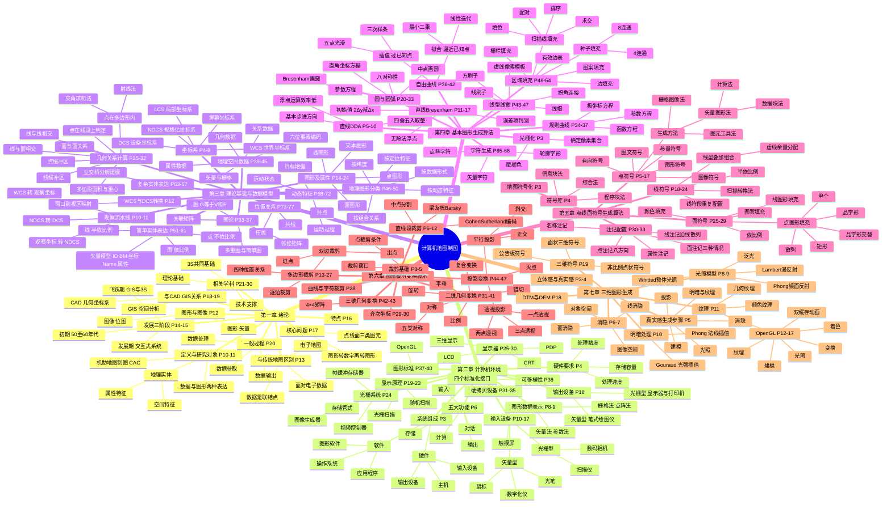

# 计算机地图制图 核心知识点思维导图

```mermaid
mindmap
  root((计算机地图制图))
    第一章 绪论
      定义与研究对象 P10-11
        机助地图制图 CAC
        地理实体
          空间特征
          属性特征
        数据与图形两种表达
      图形与图像 P12
        图形 矢量
        图像 位图
      与传统地图区别 P13
        面对电子数据
        数据是联结点
        电子地图
      发展三阶段 P14-15
        初期 50至60年代
        发展期 交互式系统
        飞跃期 GIS与3S
      特点 P16
      核心问题 P17
        图形转数字再转图形
        点线面三类图元
      与CAD GIS关系 P18-19
        CAD 几何坐标系
        GIS 空间分析
      一般过程 P20
        数据获取
        数据处理
        数据输出
      相关学科 P21-30
        理论基础
        技术支撑
        3S共同基础
    第二章 计算机环境
      系统组成 P3
        硬件
          主机
          输入设备
          输出设备
        软件
          操作系统
          图形软件
          应用程序
      硬件要求 P4
        处理速度
        存储容量
        处理精度
      五大功能 P6
        计算
        存储
        输入
        输出
        对话
      图形数据表示 P8-9
        栅格法 点阵法
        矢量法 参数法
      输入设备 P10-17
        矢量型
          鼠标
          数字化仪
          光笔
        光栅型
          扫描仪
          数码相机
        触摸屏
      输出设备 P18
        矢量型 笔式绘图仪
        光栅型 显示器与打印机
      显示原理 P19-23
        随机扫描
        存储管式
        光栅扫描
      光栅系统 P24
        图像生成器
        帧缓冲存储器
        视频控制器
      显示器 P25-30
        CRT
        LCD
        PDP
        三维显示
      硬拷贝设备 P31-35
      可移植性 P36
        四个标准化接口
      图形标准 P37-40
        OpenGL
    第三章 理论基础与数据模型
      坐标系 P4-9
        WCS 世界坐标系
        LCS 局部坐标系
        DCS 设备坐标系
        NDCS 规格化坐标系
        屏幕坐标系
      观察流水线 P10-11
        WCS 转 观察坐标
        观察坐标 转 NDCS
        NDCS 转 DCS
      WCS与DCS转换 P12
        窗口到视区映射
      图形及属性 P14-24
        点图形
        线图形
        面图形
        文本图形
      几何关系计算 P25-32
        点缓冲区
        线缓冲区
        多边形面积与重心
        点在线段上判定
        点在多边形内
          射线法
          夹角求和法
        线与线相交
        线与面相交
        面与面关系
      图论 P33-37
        图 G等于V和E
        多重图与简单图
        邻接矩阵
        关联矩阵
      地理空间数据 P39-45
        属性数据
        几何数据
        关系数据
        矢量与栅格
        六位要素编码
      地理图形分类 P46-50
        按定位特征
        按数据形式
        按纬度
        按组合关系
        按动态特征
      简单实体表达 P51-61
        点 不依比例
        线 半依比例
        面 依比例
        矢量模型 ID BM 坐标 Name 属性
      复杂实体表达 P63-67
        立交桥分解建模
      动态特征 P68-72
        目标增强
        运动状态
        运动过程
      位置关系 P73-77
        共点
        共线
        压盖
    第四章 基本图形生成算法
      光栅化 P3
        确定像素集合
        赋颜色
      直线DDA P5-10
        基本步进方向
        四舍五入取整
        浮点运算效率低
      直线Bresenham P11-17
        误差项判别
        初始值 2Δy减Δx
        无除法浮点
      圆与圆弧 P20-33
        直角坐标方程
        参数方程
        八对称性
        中点画圆
        Bresenham画圆
      规则曲线 P34-37
        函数方程
        参数方程
        极坐标方程
      自由曲线 P38-42
        插值 过已知点
          三次样条
          五点光滑
        拟合 逼近已知点
          线性迭代
          最小二乘
      线型线宽 P43-47
        虚线像素模板
        线刷子
        方刷子
        线帽
        拐角连接
      区域填充 P48-64
        扫描线填充
          求交
          排序
          配对
          填色
        有效边表
        边填充
        栅栏填充
        种子填充
          4连通
          8连通
        图案填充
      字符生成 P65-68
        点阵字符
        矢量字符
        轮廓字形
    第五章 点线面符号生成算法
      地图符号化 P3
      符号库 P4
        信息块法
        程序块法
        综合法
      点符号 P5-17
        图形符号
        图像符号
        图文符号
        有向符号
        参量符号
        生成方法
          栅格图像法
          矢量图形法
            计算法
            数据块法
          图元工具法
      线符号 P18-24
        半依比例
        扫描转换法
        线型叠加组合
          虚线余量分配
        线符段重复配置
      面符号 P25-29
        依比例
        颜色填充
        图案填充
        点图形填充
          单个
          品字形
          矩形
          品字形交替
          散列
        线图形填充
      注记配置 P30-33
        名称注记
        属性注记
        点注记八方向
        线注记沿线散列
        面注记三种情况
    第六章 图形裁剪变换技术
      裁剪基础 P3-5
        裁剪窗口
        点裁剪条件
      直线段裁剪 P6-12
        CohenSutherland编码
        中点分割
        梁友栋Barsky
      多边形裁剪 P13-27
        四种位置关系
        逐边裁剪
        双边裁剪
          进点
          出点
      曲线与字符裁剪 P28
      齐次坐标 P29-30
      二维几何变换 P31-41
        平移
        旋转
        比例
        对称
          五类对称
        错切
        复合变换
      三维几何变换 P42-43
        4×4矩阵
      投影变换 P44-47
        平行投影
          正交
          斜交
        透视投影
          一点透视
          两点透视
          三点透视
        灭点
    第七章 三维图形生成
      立体感与真实感 P3-4
      真实感生成步骤 P5
        建模
        投影
        消隐
        光照
        明暗与纹理
      消隐 P6-7
        对象空间
        图像空间
        线消隐
        面消隐
      光照模型 P8-9
        泛光
        Lambert漫反射
        Phong镜面反射
        Whitted整体光照
      明暗处理 P10
        Gouraud 光强插值
        Phong 法线插值
      纹理 P11
        颜色纹理
        几何纹理
       OpenGL P12-17
        建模
        变换
        光照
        着色
        纹理
        双缓存动画
      DTM与DEM P18
      三维符号 P19
        面状三维符号
        非比例点状符号
        公告板符号
```
